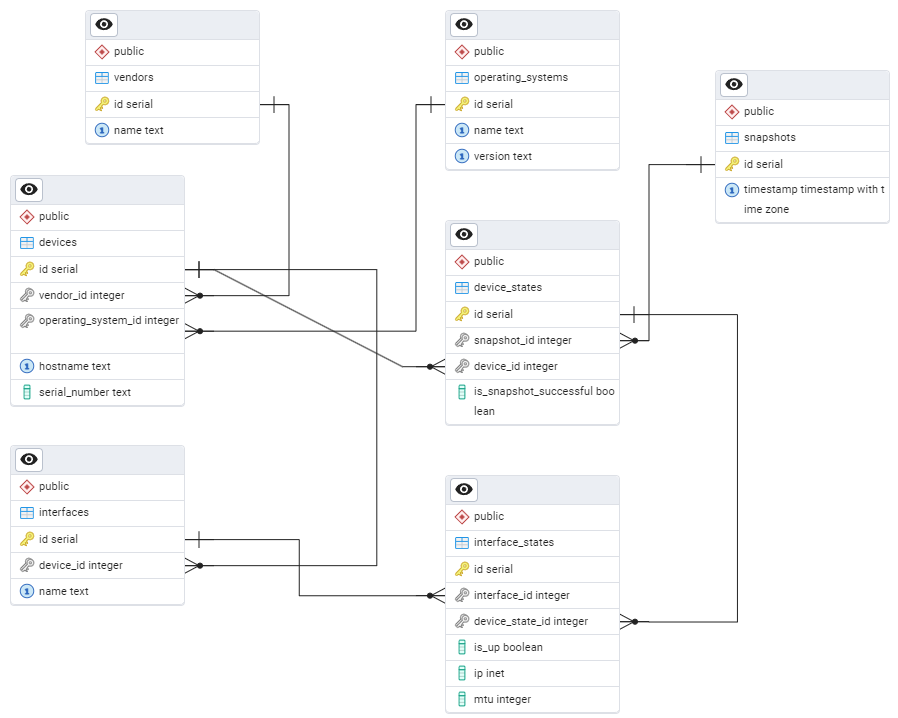

# NetMonitor
NetMonitor is a client-server solution that polls devices on the network to obtain their configuration. It was made for educational purposes.

## ERD

The image below shows Entity Relationship Diagram for the database used in the project.



## Usage
The solution includes client and server. 

The client periodically connects to the target devices via SSH and sends commands to obtain the configuration. The client uses `.json` file to form a list of target devices, for example:
```
[
    {
        "os": "nokia_srlinux",
        "hostname": "clab-srl-srl1",
        "username": "admin",
        "password": "NokiaSrl1!"
    },
    {
        "os": "nokia_srlinux",
        "hostname": "clab-srl-srl2",
        "username": "admin",
        "password": "NokiaSrl1!"
    }
]
```
The client then sends the data to the server. Communication between the client and the server uses gRPC.

The server receives data and sends it to the PostgreSQL database for storage.  The data is stored as snapshots – timestamps with a list of devices. HTTP requests are used to retrieve snapshots from the server.

To configure the client and server, `.env` files are used. Check `env` directory for more details.

## Demo
You need [task](https://taskfile.dev/), [docker](https://www.docker.com/), and [containerlab](https://containerlab.dev/) to try the demo labs. To see all tasks, use command:
```
task --list
```

To try the lab out, deploy srlinux lab by using command:
```
task deploy-srlinux
```
Create `client.env` and `server.env` files in the `env` directory.

You can build executables or simply run the client and server by using commands in separate terminals:
```
task run-server
task run-client
```
To manipulate stored snapshots, use HTTP GET requests. Endpoints:
* `/timestamps/{n}`: return the last *n* snapshot ids and timestamps;
* `/snapshot/{id}`: return snapshot by provided *id*;
* `/delete/{id}`: delete snapshot by provided *id*.
